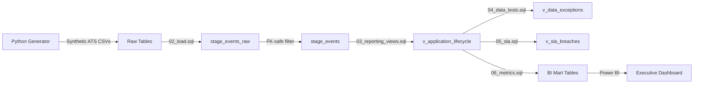

# ATS Data Integrity & SLA Monitoring Framework
**PostgreSQL · SQL · Power BI · Python**

An enterprise-grade Applicant Tracking System (ATS) data engineering framework built with an "engineering first" mindset. Models the full hiring event lifecycle, enforces data integrity via a rigorous SQL exception suite, and powers executive SLA monitoring dashboards for People and Recruiting teams.

---

## Business Problem
ATS systems accumulate silent data quality failures — orphan events, duplicate applications, stage-order violations, and missing recruiter assignments — that corrupt funnel metrics and SLA reporting before they ever reach a dashboard. This framework surfaces those failures systematically and monitors hiring velocity against defined SLA targets at the recruiter and org level.

---

## Architecture & Data Flow



1. **Raw Ingestion** — Synthetic ATS CSVs loaded via PostgreSQL `\copy` routines
2. **Integrity Filter** — `stage_events_raw` loaded without FK constraints to catch orphans; clean events promoted to `stage_events`
3. **Reporting Layer** — `v_application_lifecycle` pivots event logs into candidate-journey rows using window functions
4. **Exception Suite** — 8 automated data tests flag integrity violations by severity
5. **SLA Monitoring** — Stage transition compliance measured against defined HR SLA targets
6. **BI Marts** — Materialized tables optimized for Power BI consumption

---

## Dataset
Synthetic event-log-driven ATS data across 6 tables:

| Table | Rows | Description |
|---|---|---|
| candidates | 10,000 | One row per candidate profile |
| requisitions | 120 | One row per job opening |
| applications | 12,517 | One row per application instance |
| stage_events_raw | 30,345 | Raw event log (includes intentional anomalies) |
| offers | 381 | One row per offer extended |
| hires | 287 | One row per hire |

**Pipeline:** APPLIED → SCREEN → ONSITE → OFFER → HIRED / REJECTED / WITHDRAWN

---

## Project Structure
```
ats-integrity-sla-framework/
├── data/
│   └── raw/                          # Synthetic ATS CSV exports
├── src/
│   └── generate_synthetic_ats.py     # Python data generator with anomaly injection
├── sql/
│   ├── 01_schema.sql                 # PostgreSQL schema with PK/FK/indexes
│   ├── 02_load.sql                   # Bulk load with FK-safe orphan handling
│   ├── 03_reporting_views.sql        # Lifecycle view + funnel metrics
│   ├── 04_data_tests.sql             # 8-test exception suite (UNION ALL pattern)
│   ├── 05_sla.sql                    # SLA transition monitoring + compliance summary
│   └── 06_metrics.sql                # Materialized BI mart tables
├── docs/
│   ├── data_dictionary.md            # Table and column definitions
│   ├── metric_definitions.md         # KPI formulas and business logic
│   ├── sla_policy.md                 # SLA targets and operational context
│   └── validation_rules.md           # Exception type definitions and severity
├── requirements.txt                  # Python dependencies
└── README.md
```

---

## Key Technical Components

### 1. Dual-Table Loading Pattern (`02_load.sql`)
Loads raw events into `stage_events_raw` without FK constraints — preserving orphan events for exception detection — then promotes only valid events into the FK-constrained `stage_events` table via a JOIN filter. This separates data quality concerns from reporting concerns cleanly.

### 2. Reporting Layer (`03_reporting_views.sql`)
- `v_application_lifecycle` — pivots row-based event logs into a candidate-centric view using `MAX(CASE WHEN stage = ...)` with window functions, computing duration metrics for every stage transition
- `v_funnel_metrics` — weekly conversion rates by org, job family, and source

### 3. Data Exception Suite (`04_data_tests.sql`)
8 automated tests via `UNION ALL` pattern, classified by severity:

| Exception Type | Severity | Description |
|---|---|---|
| ORPHAN_STAGE_EVENT | HIGH | Stage event references non-existent application |
| STAGE_ORDER_VIOLATION | HIGH | Screen after Onsite, or Onsite after Offer |
| NEGATIVE_DURATION | HIGH | Computed duration < 0 (corrupts BI aggregations) |
| MULTIPLE_TERMINAL_EVENTS | HIGH | Application shows both HIRED and REJECTED |
| DUPLICATE_APPLICATION | MED | Same candidate + req within 30 days |
| OFFER_BEFORE_ONSITE | MED | Offer timestamp precedes Onsite timestamp |
| OFFER_WITHOUT_ONSITE | MED | Offer exists with no recorded Onsite stage |
| MISSING_RECRUITER | LOW | Application has no recruiter_id assigned |

### 4. SLA Monitoring (`05_sla.sql`)
Measures hiring velocity against defined HR SLA targets at recruiter and org level:

| Transition | SLA Target |
|---|---|
| Applied → Screen | 3 days |
| Screen → Onsite | 10 days |
| Onsite → Offer | 7 days |
| Offer → Decision | 5 days |

`v_sla_compliance_summary` surfaces compliance rate, average duration, and P90 duration per recruiter and org — enabling fast operational triage.

### 5. BI Mart Layer (`06_metrics.sql`)
Materializes views into indexed tables optimized for Power BI:
- `mart_application_lifecycle` — full lifecycle with all duration metrics
- `mart_data_exceptions` — exception log with severity and detection timestamp
- `mart_sla_breaches` — breach flag per application per transition
- `mart_sla_compliance_summary` — recruiter/org-level compliance rates

---

## How to Run

### 1. Generate Data
```bash
python3 -m venv venv
source venv/bin/activate
pip install -r requirements.txt
python src/generate_synthetic_ats.py
```

### 2. Load & Build
```bash
psql -d <your_db> -f sql/01_schema.sql
psql -d <your_db> -f sql/02_load.sql
psql -d <your_db> -f sql/03_reporting_views.sql
psql -d <your_db> -f sql/04_data_tests.sql
psql -d <your_db> -f sql/05_sla.sql
psql -d <your_db> -f sql/06_metrics.sql
```

### 3. Power BI
Connect Power BI to `mart_application_lifecycle`, `mart_data_exceptions`, and `mart_sla_breaches` for dashboard consumption.

---

## Power BI Dashboard

### Page 1 — KPI Summary


### Page 2 — Funnel Analysis


### Page 3 — Source & Department Breakdown


---

*Built by Harthik Mallichetty · [LinkedIn](https://www.linkedin.com/in/harthikrm/) · MSBA @ UT Dallas*
